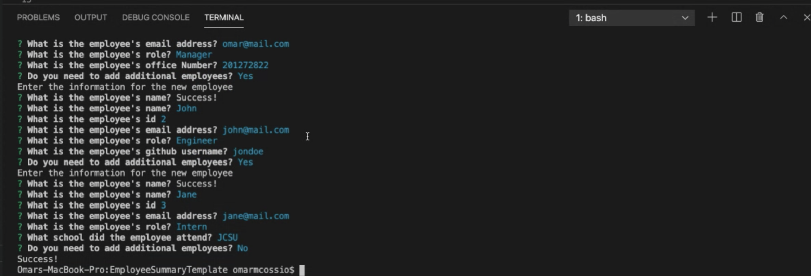
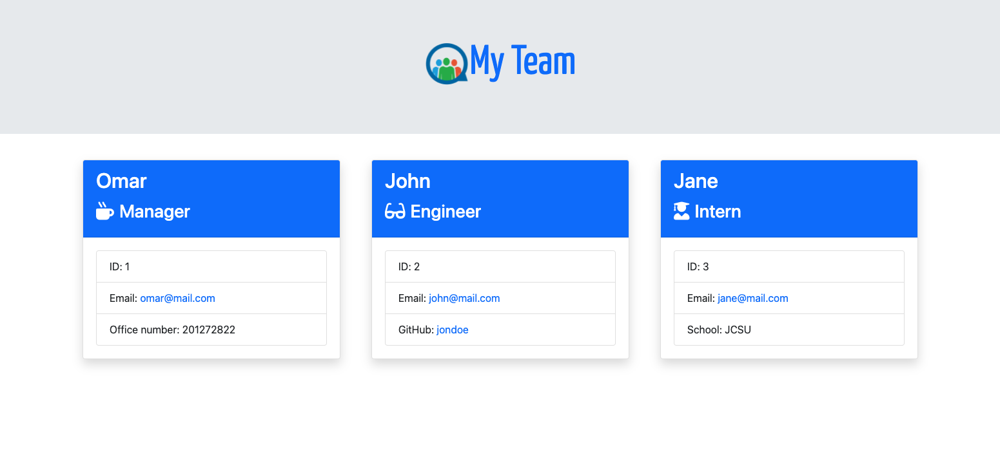

# Employee Summary Template

## Description
This application is designed to create an employee summary template, using node.js, jest, and inquirer. 

HTML is also used along with with Bootstrap as a CSS framework, font-awesome for icons, and google fonts. 

The application will run in terminal and will provide a series of questions that will later generate the information onto an html file, which can be displayed in the browser. 

The series of questions will ask for employee name, office number, email, and GitHub username, and role.  At the end of the prompt, it will ask if there are any additional employees the user needs to add. The user can select “y” for yes and “n” for no. If yes is chosen, then the user will be prompted again. Otherwise, the team.html file will be generated and the user can open it up in the browser to view. 

Part of the criteria for this project, is that there can only be one manager, so that field will be restricted to only one manager. In the questions prompted, the option for manager will only be avail be if there has not been a manager added already. Otherwise, the option for manager will not appear. 

All questions must have an answer or the prompt will not move to the next question. 

The information displayed for this application includes: Employees, Manager, Engineers, and Interns. Each employee will have their own card-style display with their provided information. 

## Table of Contents 
 * [Visuals](#visuals)
 * [Installation](#installation)
 * [Usage](#usage)
 * [Tests](#tests)
 * [Questions](#questions/support)
 * [Contributors](#Contributors)
 * [Links](#links)

## Visuals
Sample Terminal Questions

Sample Results

### Demo

## Installation
* Cloning from Github repository

## Usage
The intended user for this application is someone who needs to generate a webpage that displays their team's basic information so that they can have quick access to emails and GitHub profiles. You can see the full demo [here](https://drive.google.com/file/d/17tSvS8Qeu5RJlYOCNNu16PnxBKvwzvnW/view).

## Tests
There are 4 test clases avialble in the test folder to make sure the code is working properly. To run the tests simply call the following command on terminal:  `npm run test`

## Questions/Support
If you have any questions, please feel free to reach me at 
* [LinkedIn](https://www.linkedin.com/in/omar-cossio-7b332a12b) 
* [Github](https://github.com/omarcossio)
* [Email](mailto:omar119mce@gmail.com)

## Contributors
### Omar Cossio 
* [Omar's Github Profile](https://github.com/omarcossio)
* [Omar's LinkedIn](https://www.linkedin.com/in/omar-cossio-7b332a12b)

## Links

[Full Demo Video](https://drive.google.com/file/d/17tSvS8Qeu5RJlYOCNNu16PnxBKvwzvnW/view)

